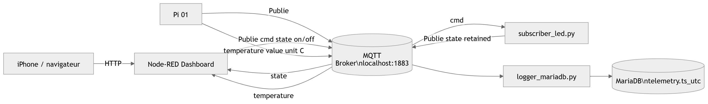
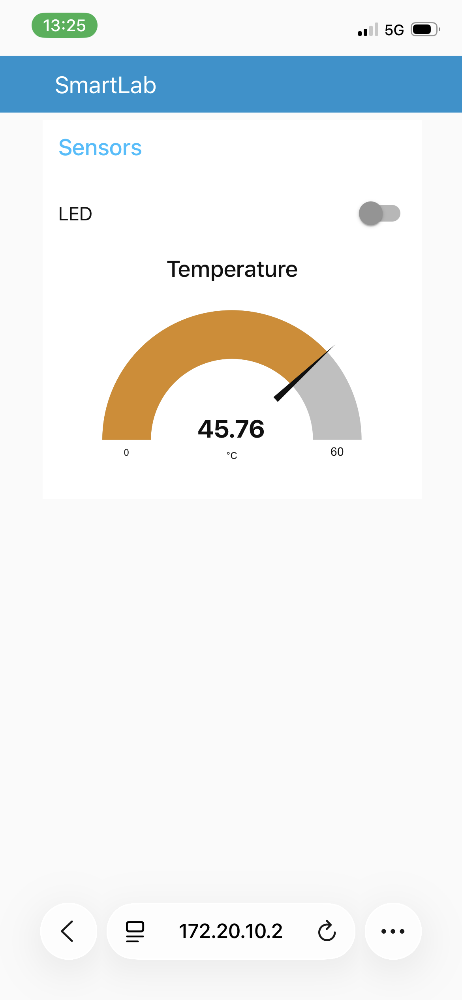
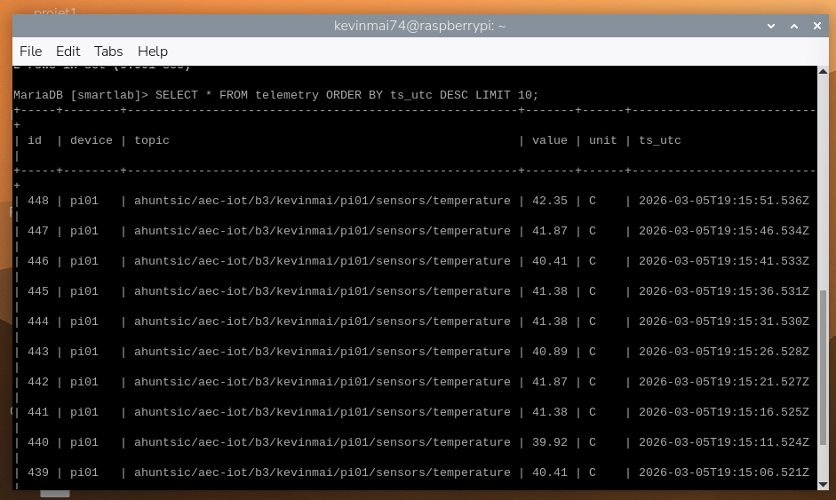

Lien GitHub :
https://github.com/kevinmai/smartlab-iot

SmartLab IoT – MQTT / Node-RED / MariaDB

Auteur
Nom d’équipe: Kevin Mai et Vincent Côté  
Cours : Développement d’objets intelligents
Device : pi01  

Base Topic :
ahuntsic/aec-iot/b3/kevinmai/pi01

Description

Ce projet IoT utilise un **Raspberry Pi** pour :

- publier une **télémétrie de température**
- contrôler une **LED via MQTT**
- synchroniser l’état réel de la LED
- afficher les données sur un **dashboard mobile Node-RED**
- enregistrer les mesures dans **MariaDB**

---

Architecture

## Architecture du projet

Voici l'architecture du système IoT utilisé dans ce projet :

Topics MQTT
Température
ahuntsic/aec-iot/b3/kevinmai/pi01/sensors/temperature

Payload :
{
 "device":"pi01",
 "sensor":"temperature",
 "value":39.43,
 "unit":"C",
 "ts":"2026-03-05T18:15:00Z"
}

Commande LED  
ahuntsic/aec-iot/b3/kevinmai/pi01/actuators/led/cmd

Payload :
{"state":"on"}
Ou 
{"state":"off"}

État LED
ahuntsic/aec-iot/b3/kevinmai/pi01/actuators/led/state
Message publié en retained.

Dashboard Node-RED
Accès :
http://<IP_RASPBERRY_PI>:1880/ui

Fonctionnalités :
•	switch LED ON/OFF
•	jauge température

Test MQTT

Voir les messages :
mosquitto_sub -h localhost -v -t 'ahuntsic/aec-iot/b3/kevinmai/pi01/#'

Tester la LED :
mosquitto_pub -h localhost -t ahuntsic/aec-iot/b3/kevinmai/pi01/actuators/led/cmd -m '{"state":"on"}'

mosquitto_pub -h localhost -t ahuntsic/aec-iot/b3/kevinmai/pi01/actuators/led/cmd -m '{"state":"off"}'

Base de données
Base :
Smartlab

Table :
telemetry

Requête SQL :
SELECT * FROM telemetry ORDER BY ts_utc DESC LIMIT 10;

Structure du projet

smartlab-iot
│
├── README.md
├── src/
│   ├── subscriber_led.py
│   ├── publisher_temperature.py
│   └── logger_mariadb.py
│
├── db/
│   └── schema.sql
│
└── flows/
    └── node_red_flow.json

Technologies
•	Raspberry Pi
•	Python
•	MQTT Mosquitto
•	Node-RED
•	Node-RED Dashboard
•	MariaDB

## 7.4 Preuves

### MQTT Dash (jauge + switch)

### Données stockées dans MariaDB

